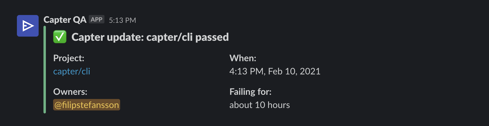

You can integrate Capter with your Slack workspace to receive alerts whenever a run fails.

## Mentions

A channel posting alerts can quickly become unusable, when there's just too many alerts and it becomes impossible to see what's relevant for who. Capter solves this by mentioning (@) the person who's responsible for investigating the problem. You set this up in the Capter web app under each projects alert settings.

In addition to that, whenver someone clicks the **Investigate** button, the notification will be updated showing that someone has started investigating the run:

## Status updates

After a failing run passes again, a new alert will be sent informing the channel that it's working again. This will include the downtime, so you can see for how long the API was broken.

